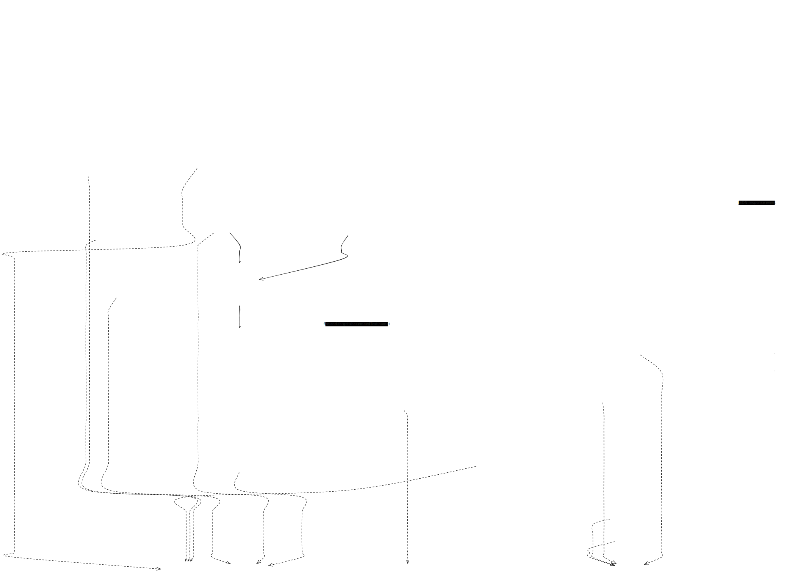

# Ntentan — Technical Documentation

An AI-native medication management platform for patients in low-resource, multilingual settings. Ntentan combines vision-language modeling (VLM) for on-camera medication label reading, an agentic medical assistant with tool calling, semantic vector search over a per-user pharmacy, and a low-latency emergency-alert channel that survives on SMS where data connectivity is unreliable.

This document describes the current architecture, the AI/ML systems and how they are engineered, and the roadmap items that turn Ntentan into a self-improving product — most importantly, the data-collection pipeline that will let us fine-tune an in-house VLM to replace Gemini for the scanner workload.

---

## 1. System Overview

### 1.1 Architectural shape



```
┌───────────────────────────┐        ┌────────────────────────────────┐
│   Flutter mobile client   │        │   Firebase (Auth · Firestore)  │
│  (camera · mic · TTS)     │◄──────►│   Cloud Functions (embeddings) │
└───────────┬───────────────┘        └────────────────▲───────────────┘
            │ WSS + HTTPS                             │
            │ (Bearer: Firebase ID token)             │  Admin SDK
            ▼                                         │
┌──────────────────────────────────────────────────────┴──────────┐
│               Node.js API (Express 5 + Socket.IO)              │
│  ┌──────────────┐  ┌──────────────────┐  ┌──────────────────┐  │
│  │ /med-scanner │  │ /api/assistant   │  │ /api/medical-alert│  │
│  │  (WebSocket) │  │  (HTTP, agentic) │  │  (HTTP, SMS)      │  │
│  └──────┬───────┘  └────────┬─────────┘  └────────┬──────────┘  │
│         │                   │                    │              │
│  Gemini 2.5 Flash VLM  Gemini tool-use    mNotify SMS gateway   │
│  Vertex text-emb-005   OpenFDA drug DB    Ghana NLP (Twi ASR/   │
│  Firestore vector KNN  Ghana NLP MT       MT/TTS)               │
└─────────────────────────────────────────────────────────────────┘
```

**Stack:**
- **Runtime**: Node.js 20 on Alpine, TypeScript 5.9, Express 5, Socket.IO 4.
- **AI SDKs**: `@google/genai` (Gemini 2.5 Flash for generation, `text-embedding-005` for vectors via Vertex AI).
- **Storage**: Firestore (documents + native `VectorValue` fields with cosine `findNearest`).
- **Identity**: Firebase Authentication (verified server-side via Firebase Admin SDK on every WS/HTTP entry).
- **Background compute**: Firebase Cloud Functions v2 (Firestore triggers for embedding regeneration).
- **Third-party APIs**: OpenFDA drug label DB, Ghana NLP (Twi STT/MT/TTS), mNotify (Ghana SMS carrier gateway).
- **Client**: Flutter mobile app under `/mobile` (Android + iOS flavors via `flutter_flavorizr`).

### 1.2 Non-functional targets

| Concern              | Target                                     | How we hit it                                                                                                                          |
| :------------------- | :----------------------------------------- | :------------------------------------------------------------------------------------------------------------------------------------- |
| Scanner e2e latency  | < 1.2 s per positioning tick               | 800 ms server buffer window, lossy frame dropping, single inflight inference gate.                                                     |
| Assistant TTFB       | < 2.5 s (text), < 5 s (Twi audio)          | `gemini-2.5-flash`, `temperature=0.2`, `maxOutputTokens=1024`; parallel tool dispatch inside the agent loop.                            |
| Semantic recall @ 1  | ≥ 0.9 within a user's medication set       | LLM-composed enrichment string + `text-embedding-005` (768-dim) + cosine KNN with distance ≤ 0.15 threshold.                            |
| Emergency alert SLO  | SMS dispatched within 3 s of API call      | Direct `fetch` to mNotify, no queue, per-contact fan-out logged with success flags.                                                    |

---

## 2. Authentication & Authorization

Every request — HTTP or WebSocket — is authenticated by Firebase ID token before any downstream logic runs.

- **HTTP** (`src/middlewares/auth.middleware.ts`): Bearer token extraction → `admin.getAuth().verifyIdToken(token)` → decoded claims attached to `req.user`.
- **WebSocket** (`src/middlewares/socket-auth.middleware.ts`, wired at `io.of("/med-scanner").use(...)` in `src/index.ts`): same verifier, run once per connection handshake; `socket.user` is populated for the lifetime of the socket.
- **Authorization model**: the `uid` from the verified token is the sole tenant key. Every Firestore path is scoped `users/{uid}/...`, so a compromised token cannot reach another user's data even if a route forgot to filter.

The client can present the token as `Authorization: Bearer <jwt>`, `socket.handshake.auth.token`, or as a `?token=` query parameter on the WS URL — all three land in the same verifier.

---

## 3. Feature: Medication Scanner (Real-Time VLM)

### 3.1 What it does

The user opens the camera in the mobile app, points it at any medication package, and the app streams JPEG frames over a WebSocket. The server continuously runs a VLM on the freshest frame and either (a) sends camera-positioning instructions back until the label is legible, or (b) extracts the label text, structures it into pharmacological fields, and matches it against the user's saved prescriptions using vector search.

### 3.2 Wire protocol

- **Namespace**: `/med-scanner` (Socket.IO).
- **Client → Server**: `frame` event with `{ buf: ArrayBuffer }` — a JPEG.
- **Server → Client**: `response` event with a **JSON string** (client must `JSON.parse`). Payloads are validated at the boundary with a Zod discriminated union (`medScannerResponseSchema` in `src/types/medscanner.ts`), so no malformed contract can escape the server.

Response variants (`status` is the discriminant):
- `processing` — inference has started.
- `positioning` / `no_object` — includes `instruction ∈ {move_up, move_down, move_left, move_right, rotate_left, rotate_right, flip, move_closer, move_farther, hold_still, none}` plus a one-sentence `guidance_text`.
- `success` — includes `guidance_text` and a nullable `prescription_match` (the top KNN hit from the user's medication collection, with `distance` and a `withinThreshold` boolean).

### 3.3 Frame pipeline (backpressure engineering)

Camera frames arrive faster than any VLM can consume them, and a naïve pipeline would either overrun the model or lag several seconds behind reality. The pipeline in `src/features/medication-scanner/medscanner.service.ts` is built around three ideas:

1. **Buffered flush**: A per-connection `frameBuffer` accumulates up to `BUFFER_MAX_FRAMES = 5` base64-encoded JPEGs. A `setInterval` fires `flushBuffer` every `BUFFER_FLUSH_INTERVAL_MS = 800` ms; a full buffer eager-flushes without waiting for the timer.
2. **Single inflight inference gate**: `isInferring` acts as a per-socket mutex. While the VLM call is in flight, the buffer is not drained.
3. **Latest-only when saturated**: If a `frame` arrives while `isInferring` is true, the buffer is replaced with **just the newest frame** (`frameBuffer = [base64Image]`). This is a deliberately lossy strategy: we would rather show the user guidance about *now* than about 800 ms ago.

The result is bounded memory per connection, no queue explosion under model slowness, and guidance that always references the most recent visible pose.

### 3.4 VLM call and structured decoding

The VLM call uses `gemini-2.5-flash` with all buffered frames sent as a single multi-part `user` message (system prompt first, then N `inlineData` JPEGs). Determinism at the JSON boundary is enforced with:

```ts
config: {
  responseMimeType: "application/json",
  responseModalities: [Modality.TEXT],
  responseSchema: RESPONSE_SCHEMA,
}
```

`RESPONSE_SCHEMA` fixes the enum sets for `status` and `instruction` and marks `medication` as only-present-when-success. Because the schema is enforced by the SDK, the client never has to defend against a hallucinated status or instruction verb.

### 3.5 Two-stage extraction

When the model returns `status: "success"`, the raw output only carries a `drug_name` and an array of raw label text lines. A **second Gemini call** (`extractMedicationFields`) restructures those tokens into a pharmacology-oriented record: `brand_name`, `generic_name`, `manufacturer`, `dosage_form`, `concentration`, `product_category`, a `confidence` score, and any `unmatched_tokens` we chose not to force into a field. Again this is schema-enforced; nullable fields are explicit so downstream code can trust the shape.

Splitting extraction into two calls buys us two things: cheaper positioning ticks (the tight-loop call has a small schema and no pharmacology reasoning), and a clean place to swap in a specialized in-house model later without touching the streaming loop.

### 3.6 Prescription matching (vector search)

The extracted fields are collapsed to a query string (brand + generic + concentration + category + form) and embedded with `text-embedding-005` on Vertex AI. The user's `users/{uid}/medications` subcollection stores a `name_embedding` `VectorValue` on each doc, so matching is a native Firestore `findNearest`:

```ts
medicationsRef.findNearest({
  vectorField: "name_embedding",
  queryVector: FieldValue.vector(queryVector),
  limit: 5,
  distanceMeasure: "COSINE",
  distanceResultField: "vector_distance",
});
```

A distance threshold of `0.15` gates "confident match" vs. "not on file." Below the threshold, the client can trust the match; above it, the app treats the scan as unknown and prompts the user to save the prescription.

### 3.7 Prompt engineering

The scanner system prompt is minimal on style and heavy on constraints: it fixes the field set, the enum for `status`, the enum for `instruction`, forbids inventing field names, and hard-caps the number of concurrent instructions to one. This matters because the VLM would otherwise gladly invent five-step positioning routines that the mobile UI has no state for.

The pharmacology extractor prompt does the opposite — it explicitly *allows* nulls, so the model doesn't hallucinate a `generic_name` when only a brand is visible. A `confidence` field is required so downstream code can down-rank low-signal extractions before they even reach vector search.

---

## 4. Feature: Medical Assistant (Agentic Chat)

### 4.1 Shape

`POST /api/assistant/chat` (see `src/features/assistant/assistant.routes.ts`) accepts a message + history + language and returns a message + updated history (+ audio if the conversation is in Twi). The client is stateless — it owns and resends the transcript on every turn. The server is stateless too; there is no per-user session store.

### 4.2 Agent loop

`MedicalAssistant.chat()` in `src/features/assistant/assistant.ts` runs a classic tool-calling loop:

1. Build a `Content[]` history, with user turns and prior model turns.
2. Call `gemini-2.5-flash` with `systemInstruction`, `tools`, `temperature: 0.2`, `maxOutputTokens: 1024`.
3. If the response contains any `functionCall` parts, **dispatch them in parallel** (`Promise.all`), append their `functionResponse` parts to the transcript, and loop.
4. If no function calls, extract the final text and return with `toolsUsed` and `sources` metadata.

Parallel dispatch matters because Gemini will sometimes emit two calls in one turn (e.g. `query_prescriptions` and `search_drug_info` simultaneously); running them sequentially would double the tail latency of the assistant.

### 4.3 Tools

Three tools are declared in `src/features/assistant/assistant.tools.ts`:

- **`query_prescriptions`** — the personal-medication router. Intent enum: `next` (what to take now, computed against `TIME_WINDOWS` in `src/lib/DateHelpers.ts`), `medication_info` (details of one drug), `all_active` (list everything). Drug-name matching is semantic, not substring: it embeds the user's phrasing and cosine-scores against stored `name_embedding` vectors (threshold `0.6`), falling back to `.includes()` only if embedding fails. See `src/features/assistant/prescription.tools.ts`.
- **`search_drug_info`** — factual drug information from **OpenFDA's `/drug/label.json`** endpoint (`src/features/assistant/drugInfo.tools.ts`). Attempts brand-name then generic-name search, extracts uses, warnings, interactions, and adverse reactions. If FDA lacks sufficient data, returns `needsLLMSupplement: true`, which the system prompt tells Gemini to fill from its own knowledge — with a mandatory "consult your doctor" tail line.
- **`save_prescription`** — writes to `users/{uid}/medications/{docId}` with a canonical schema (`timeSlots`, `dosage`, `unitsPerDose`, `frequency`, `strength?`, `instruction?`). The system prompt forces the model to ask for missing required fields one question at a time before invoking the tool — a UX pattern that prevents silent field-defaulting.

### 4.4 Embedding write-path

When a prescription is saved through the assistant, we fire-and-forget an `embedText(name)` and patch the resulting `name_embedding` back onto the document (`src/features/assistant/prescription.tools.ts:150`). A **Firestore-triggered Cloud Function** (`functions/index.js`, `embedMedicationOnWrite`) also watches every write to `users/{userId}/medications/{medicationId}` and regenerates the embedding **when `name` or `dosage` changes, or when the embedding is missing** — so third-party writes (mobile app, admin console, backfill script) stay in sync without touching the API.

The function does one more thing that pure "embed the name" would miss: it calls `buildCompositeString(name, dosage)` — an LLM enrichment step that expands the raw fields into a pharmacology-rich natural-language paragraph (INN, class, indications, synonyms) and *embeds that instead*. Semantic recall shoots up because the vector now covers everything a user might phrase a question with, not just the trademarked name they typed.

A companion one-time backfill script lives at `scripts/createVectorField.js`.

### 4.5 Prompt engineering & safety

The system prompt in `buildSystemPrompt()` enforces:
- **Tool-before-answer**: the assistant may never answer a personal prescription question without first calling `query_prescriptions`.
- **Time-of-day slots** rather than clock times, because our users think in "morning / afternoon / evening" and calendaring exact timestamps across timezones is a foot-gun.
- **Hard safety rules** at the bottom: no diagnosis, no prescribing, no dosage changes, immediate redirect on medical emergencies or self-harm.
- **Mandatory disclaimer tail** on general drug information.

Temperature is pinned at `0.2` so the model plays close to the tool-calling script rather than freelancing.

---

## 5. Feature: Twi Voice Pipeline

Ghanaian users often prefer speaking Twi. The pipeline in `src/features/assistant/voice.service.ts` handles round-trip translation and speech:

**Ingress path** when `language === "twi"`:
1. If input is audio → `twiSTT()` (Ghana NLP ASR, `audio/mpeg` POST) → Twi text.
2. `twiToEnglish()` (Ghana NLP MT, `lang: "tw-en"`) → English text.
3. Feed English into the Gemini agent loop.

**Egress path**:
1. Gemini answers in English.
2. `englishToTwi()` (Ghana NLP MT, `lang: "en-tw"`) → Twi text.
3. `twiTTS()` (Ghana NLP TTS) → audio buffer → base64 → returned as `audio` in the JSON response.

English-only requests skip the STT/MT hops entirely — the assistant service inlines the audio directly into Gemini as `inlineData` with `mimeType: "audio/wav"`, using Gemini's native multi-modal audio ingest. That means for English audio, transcription is *fused into the same forward pass* as reasoning, which is both faster and preserves prosodic cues.

Assistant history stores audio turns as the placeholder string `"[User sent an audio message]"` to keep transcripts token-cheap without losing turn structure.

---

## 6. Feature: Medical Alert (SMS Emergency Channel)

`POST /api/medical-alert/send` (`src/features/medical-alert/medical-alert.service.ts`) is the "help me" button. It:

1. Reads the authenticated user's `emergencyConfig.contacts` from Firestore.
2. Builds a Google Maps link `https://www.google.com/maps?q=lat,lng` from the request body.
3. Fans out an SMS to each contact via **mNotify** (Ghanaian bulk-SMS gateway) with a fixed emergency template.
4. Returns a per-contact success matrix so the client can show which contacts were reached.

We chose SMS over push notifications because the emergency recipient (a family member) may not have the Ntentan app installed and may not have a data connection when the alert fires. SMS is the lowest common denominator that still works over 2G.

---

## 7. Data Model

### 7.1 Firestore layout

```
users/{uid}
  userName: string
  emergencyConfig:
    contacts: [{ name, phoneNumber, relationship }, ...]

users/{uid}/medications/{medId}
  name:              string          // "Amoxicillin"
  strength:          string          // "500mg"
  dosage:            string          // "tablets"
  unitsPerDose:      number          // 2
  frequency:         number          // times/day
  timeSlots:         string[]        // ["morning","evening"]
  instruction:       string
  completedSlots:    Record<string,string>   // slotName → ISO timestamp
  composite_string:  string          // LLM-enriched search phrase
  name_embedding:    VectorValue     // 768-dim, text-embedding-005
  createdAt/updatedAt: ISO timestamps
  embedded_at:       server timestamp
```

### 7.2 Vector index

Firestore's `findNearest` requires a vector index on `name_embedding` (768 dims, cosine distance). Provisioned once per collection group. Distances are bounded to `[0, 2]` under cosine; empirically, matches within the user's own catalog land at `< 0.15` and unrelated drugs sit around `0.3–0.6`.

---

## 8. Reliability & Operational Concerns

### 8.1 Error surface

- **Structured errors** (`src/lib/errors.ts`): `UnauthorizedError`, `ExternalServiceError`, etc. — all funnelled through `globalErrorHandler` (HTTP) or `emitSocketError` (WS).
- **Socket-level guards**: every VLM/embedding call is `try/catch`'d; failure emits an `error` event to the client and (in the current build) disconnects the socket to force a clean reconnect. This is aggressive but predictable during a demo.
- **Process-level**: `uncaughtException` and `unhandledRejection` fatally log-and-exit so the container orchestrator restarts a clean process. `SIGTERM` triggers graceful `server.close()`.

### 8.2 Logging

`src/lib/logger.ts` is a structured logger used across every feature. Every log line carries at least `path`/`socketId`/`uid` where available, so incidents can be traced across the WS + HTTP + Cloud Function boundary.

### 8.3 Deployment

- **API**: multi-stage Dockerfile (`node:20-alpine` builder + runner), `npm ci --only=production` for the final image, exposes `8080`. Designed to run on Cloud Run / Fly / any container host.
- **Cloud Functions**: deployed with `firebase deploy --only functions` under the `functions/` module. `setGlobalOptions({ maxInstances: 10 })` caps the embedding worker fan-out.

---

## 9. AI Engineering Summary

Consolidating the AI decisions scattered across the features:

| Area                       | Choice                                                     | Why                                                                                                     |
| :------------------------- | :--------------------------------------------------------- | :------------------------------------------------------------------------------------------------------ |
| Vision-language model      | `gemini-2.5-flash`                                         | Multi-image ingest, JSON-mode with `responseSchema`, low latency, cheap enough for streaming.           |
| Text embedding             | `text-embedding-005` (Vertex, 768-dim)                     | Native support in Firestore vector search; strong biomedical recall vs. `text-embedding-004`.            |
| Retrieval                  | Firestore `findNearest`, cosine, per-user subcollection    | Sub-tenant isolation is a schema property, not a query filter — cheaper and safer.                     |
| Structured decoding        | `responseMimeType: "application/json"` + `responseSchema`  | Eliminates hand-rolled parsing/repair loops; enum-typed fields prevent hallucinated verbs.              |
| Agent style                | Tool-calling with mandatory pre-answer tool call           | Prevents Gemini from answering from memory when personal data is required.                             |
| Concurrency inside agent   | `Promise.all` over parallel function calls per turn        | Halves tail latency when the model emits multiple tool calls in one step.                              |
| Frame throttling           | Buffered flush + inflight mutex + latest-frame-wins        | Bounds memory and latency simultaneously.                                                              |
| Enrichment before embed    | LLM composes a pharmacology-rich `composite_string`         | Boosts semantic recall when users query with generic names / synonyms.                                 |
| Safety                     | System-prompt hard rules, mandatory disclaimer tail        | Cheap, auditable, no external policy engine required.                                                  |
| Multilingual UX            | Route Twi through Ghana NLP for STT/MT/TTS; use Gemini native audio for English | Uses the best tool per language; avoids paying for MT on the fast path.        |

---


### 10.1 Scanner-Data Capture Loop for VLM Fine-Tuning

**Goal**: replace `gemini-2.5-flash` on the scanner path with a purpose-trained in-house VLM that is smaller, cheaper, faster, and — critically — better at Ghanaian pharmaceutical packaging (which is under-represented in general-purpose VLM training data).

**What we will store, per scanner turn:**

```
scanner_captures/{captureId}
  userId:            string           // owning tenant
  socketId:          string
  capturedAt:        server timestamp
  session_id:        string           // one scan session may produce many turns
  turn_index:        number
  frames:
    - path: gs://ntentan-scanner-raw/{userId}/{captureId}/{n}.jpg
      byte_size: number
      captured_at_client_ms: number
  model_input:
    system_prompt_hash: string        // for prompt-version bucketing
    schema_hash:        string
  model_output:
    raw_json:          string         // exact Gemini payload
    status:            "processing"|"positioning"|"no_object"|"success"
    instruction:       string
    guidance_text:     string
    medication:        { drug_name, raw_label_text[] } | null
    latency_ms:        number
    finish_reason:     string
  extraction:                          // present iff status=="success"
    fields:            MedicationLabelFields
    confidence:        number
  match:                               // present iff status=="success"
    match_id:          string | null
    distance:          number | null
    within_threshold:  boolean
  user_feedback:                       // optional, populated by client later
    accepted:          boolean
    corrected_fields:  MedicationLabelFields | null
    correction_reason: string | null
```

**Storage tiering:**
- Raw JPEGs → **Google Cloud Storage** (`gs://ntentan-scanner-raw/`), lifecycle-ruled to archive class after 30 days.
- Metadata + model outputs → Firestore `scanner_captures` collection (indexed by `userId`, `capturedAt`, `status`).
- Consent gate: capture is opt-in per user (`users/{uid}.scannerDataConsent = { granted, grantedAt, ip }`) and honored on every write.

**PII controls:**
- Frames are stored under the user's `uid` bucket with signed-URL access only.
- A background Cloud Function will run a face-detection blur pass on every uploaded frame before the object is released for training use.
- Deletion API: `DELETE /api/scanner/captures?before=<iso>` wipes both GCS objects and Firestore docs for the caller's `uid`, honoring GDPR-style erasure.

**Labeling pipeline:**
1. **Weak labels** — the current Gemini output is stored as-is; low-confidence extractions (`confidence < 0.7`) are flagged for review.
2. **Human labels** — a lightweight web reviewer app lets internal annotators correct `medication_fields` and (crucially) mark whether the current `instruction` was the *right* positioning cue for that frame.
3. **Feedback labels** — user acceptance/rejection of the extracted match becomes a free implicit label at inference time.

**Training targets:**
- **Positioning head**: multi-class classifier over the 10-value `instruction` enum, trained against frames where a human reviewer confirmed the ground-truth cue. Small — likely a distilled MobileViT-class backbone + a linear head.
- **Extraction head**: an OCR-plus-parser distilled from Gemini's structured output. Candidate architectures: a Qwen2-VL 2B / PaliGemma 2 3B base, LoRA-finetuned on our captures. Because our schema is fixed and narrow, we can afford a much smaller base than the general-purpose Gemini path.

**Swap-in seam**: `flushBuffer()` in `medscanner.service.ts` calls `ai.models.generateContent` with a fixed schema. Replacing it means introducing an interface (`interface MedScannerVlm { infer(frames): MedScannerModelOutput }`) and a router that A/B splits traffic between the Gemini implementation and the in-house implementation by `userId` hash. Success/positioning outputs go through the same Zod validator, so a bad model can never break the wire contract.

**Metrics we will track:**
- **Positioning accuracy**: % of frames where the model's instruction matches the reviewer's ground truth.
- **Extraction F1**: field-level F1 vs. reviewer-corrected records.
- **Match agreement**: does the in-house model's `prescription_match` agree with Gemini's within the same session? (Cheap to compute during dual-run.)
- **Latency & cost delta**: p50 / p95 inference latency and $/scan.

### 10.2 Response Storage for the Assistant (RLHF / SFT dataset)

Analogous to §10.1 for the chat pipeline: log every `(system_prompt, tools, history, user_message) → (tool_calls, tool_results, final_answer)` tuple to a `assistant_traces` Firestore collection, plus a `thumbs_up/down` field the mobile UI will surface. This becomes:
- An SFT corpus for training a smaller conversational model on our specific tool schema.
- A reward-modeling signal for later DPO / RLHF passes.
- A regression harness — replay past turns against a new model version and diff the tool-call sequences.

### 10.3 Rate Limiting & Abuse Controls

- Per-`uid` token-bucket on the `/med-scanner` namespace (frames/sec cap) to prevent a rogue client from burning the Gemini budget.
- Per-`uid` daily cap on `/api/assistant/chat` calls (config-driven).
- Structured audit log of all `save_prescription` invocations for post-hoc misuse detection.

### 10.4 Offline & Degraded-Network Modes

- Cache the last-known `all_active` prescription set client-side; the assistant can answer "next dose" without a round-trip when offline.
- Local `SharedPreferences` mirror of `TIME_WINDOWS` so slot logic keeps working with no network.
- SMS fallback: if `/api/assistant/chat` fails after N retries, mobile falls back to an SMS-based Q&A path over mNotify.

### 10.5 Observability

- OpenTelemetry traces across HTTP → Gemini → Firestore, exported to a hosted collector.
- Per-model latency histograms tagged with `model_id`, `schema_hash`, `prompt_hash`.
- Alerting rule: p95 scanner latency > 2 s for 5 minutes → PagerDuty.


---

## 11. Repository Layout (Reference)

```
src/
  index.ts                                # Express + Socket.IO bootstrap
  features/
    medication-scanner/medscanner.service.ts   # VLM streaming pipeline + vector match
    assistant/
      assistant.routes.ts                 # POST /api/assistant/chat
      assistant.service.ts                # Language routing (Twi ↔ English)
      assistant.ts                        # Agent loop (MedicalAssistant)
      assistant.tools.ts                  # Tool declarations
      prescription.tools.ts               # Personal-med query + save
      drugInfo.tools.ts                   # OpenFDA lookup
      voice.service.ts                    # Ghana NLP STT/MT/TTS
    medical-alert/
      medical-alert.routes.ts             # POST /api/medical-alert/send
      medical-alert.service.ts            # mNotify SMS fan-out
  lib/
    firebase.ts                           # Admin SDK singleton
    embeddings.ts                         # Vertex text-embedding-005 wrapper
    DateHelpers.ts                        # TIME_WINDOWS logic
    logger.ts / errors.ts / socket-error-handler.ts
  middlewares/                            # auth, validator, error handler, socket auth
  types/                                  # Zod + TS types (assistant, medscanner)
functions/
  index.js                                # Firestore trigger: embedMedicationOnWrite
scripts/
  createVectorField.js                    # One-time embedding backfill
mobile/                                   # Flutter client (Android + iOS)
Dockerfile
```

---

